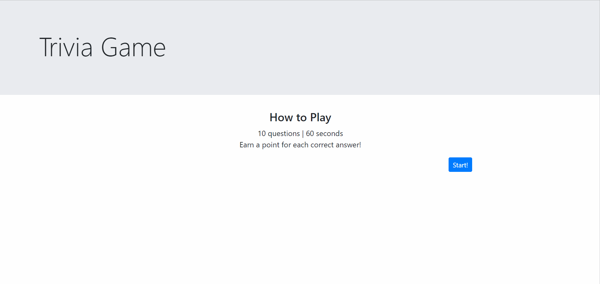

# Trivia Game

## Description
A trivia game using where players must answer 10 questions in 60 seconds. This game utilizes JavaScript timers to keep track of time and jQuery to dynamically update HTML. Questions were pulled from the Open Trivia Database.

Questions are stored in an array of objects. When the game begins, the first question is pulled from the object and sent to the page. The correct answer is pulled and stored in a global variable for later comparison. All possible answers are pulled out of the question object and sent to an array. That array is then shuffled before being iterated over to render available choices on the page, ensuring that the correct answer is never rendered in the same order each time.

A CSS animation is used to animate action text that conveys instructions and player progress throughout the game.

## Technologies
* HTML
* CSS
* JavaScript
* jQuery
* Bootstrap
* [Open Trivia Database](https://opentdb.com/)

## Usage
Navigate to the game by clicking [here](https://rebeccagoldstein.github.io/TriviaGame/).

Click on the correct answer for each question.

## Future Developments
* Polish front-end.
* Add high score board.
* Utilize Open Trivia Database API.

## License
MIT License